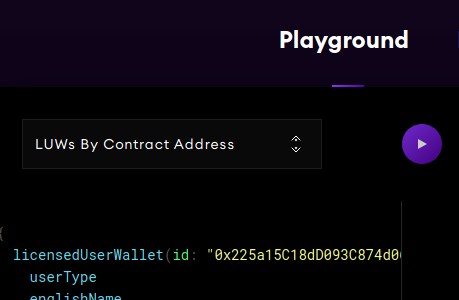

# Startrail Subgraph

This Subgraph indexes events from the Startrail smart contracts.

See [The Graph Documentation](https://thegraph.com/docs/quick-start) for details of how to develop and deploy the subgraph.

# Example Queries

Example queries can be selected in the GraphQL playground here:

See also the Startrail API startrail-graph-client module which has predefined queries used by the API.

# Subgraph unit test

When testing subgraphs, you should run seed-extended in addition to seed-minimal.